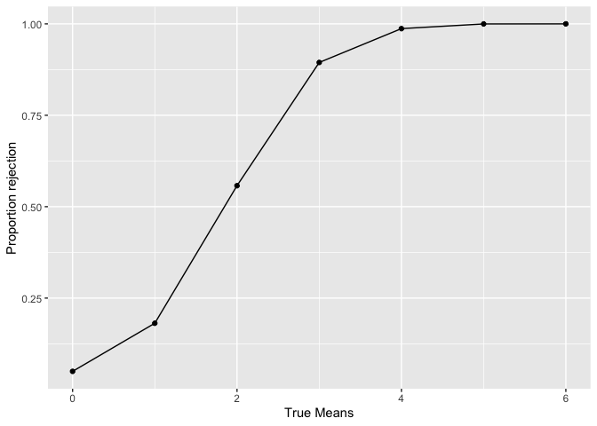
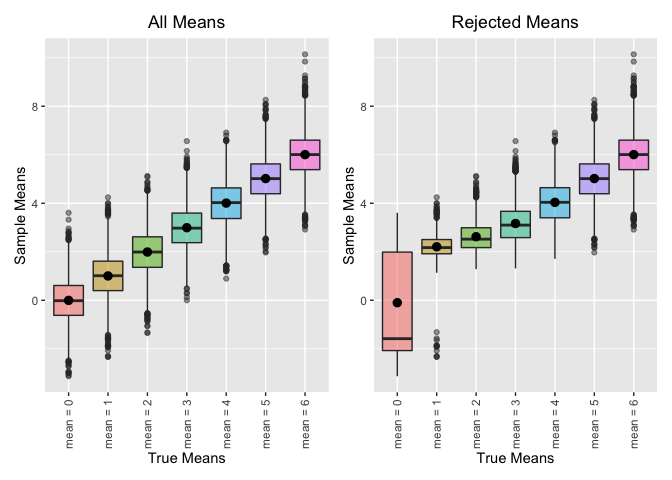

homework\_5
================
Matthew Lawlor
11/18/2020

# Problem 1

### Read and tidy data

``` r
homicide_df = read.csv("./data/homicide_data.csv") %>% 
  janitor::clean_names() %>% 
  mutate(
    city_state = paste(city, state, sep = ", ")
  )
```

The homicide dataframe has 52179 rows and 13 columns. Information
included on murders in 50 US cities from 2007-2017. Murders are
classified as open/no arrest, closed by arrest, and closed without
arrest.

### Homicides per city

First total homicides per city

``` r
total_homicides =
homicide_df %>% 
  group_by(city_state) %>% 
  summarize(
    n_homicides = n(),
  )
```

    ## `summarise()` ungrouping output (override with `.groups` argument)

Then unsolved homicides per city

``` r
unsolved_homicides =
  homicide_df %>%
  filter(disposition == "Closed without arrest" | disposition == "Open/No arrest") %>% 
  group_by(city_state) %>% 
  summarize(
    n_open_homicides = n()
  )
```

    ## `summarise()` ungrouping output (override with `.groups` argument)

Then join dataframes

``` r
open_total_homicides =
    full_join(unsolved_homicides, total_homicides)
```

    ## Joining, by = "city_state"

``` r
open_total_homicides[is.na(open_total_homicides)] <- 0
```

### Proportion of homicides that are unsolved

First in Baltimore, MD

``` r
prop.test(
open_total_homicides %>%  filter(city_state == "Baltimore, MD") %>%  pull(n_open_homicides),
open_total_homicides %>%  filter(city_state == "Baltimore, MD") %>%  pull(n_homicides)
) %>%
broom::tidy()
```

    ## # A tibble: 1 x 8
    ##   estimate statistic  p.value parameter conf.low conf.high method    alternative
    ##      <dbl>     <dbl>    <dbl>     <int>    <dbl>     <dbl> <chr>     <chr>      
    ## 1    0.646      239. 6.46e-54         1    0.628     0.663 1-sample… two.sided

Then iterate prop.test across all cities

``` r
results = 
open_total_homicides %>% 
  mutate(
    prop_tests = map2(.x = n_open_homicides, .y = n_homicides, ~prop.test(x = .x, n = .y)),
    tidy_tests = map(.x = prop_tests, ~broom::tidy(.x))
  ) %>% 
  unnest(tidy_tests) %>% 
  select(city_state, estimate, conf.low, conf.high)
```

    ## Warning: Problem with `mutate()` input `prop_tests`.
    ## ℹ Chi-squared approximation may be incorrect
    ## ℹ Input `prop_tests` is `map2(...)`.

    ## Warning in prop.test(x = .x, n = .y): Chi-squared approximation may be incorrect

### Plotting

``` r
results %>% 
  mutate(city_state = fct_reorder(city_state, estimate)) %>% 
  ggplot(aes(x = city_state, y = estimate)) +
  geom_point() +
  geom_errorbar(aes(ymin = conf.low, ymax = conf.high)) +
  theme(axis.text.x = element_text(angle = 90))
```

<!-- -->

## Problem 2

### Read and tidy data

Includes multiple spreadsheets

``` r
longitudinal_df = 
  tibble(
    path = list.files("prob_2"),
  ) %>% 
  mutate(
    path = str_c("prob_2/", path),
    data = map(path, read_csv)
    ) %>%
  unnest(data) %>%
  mutate(path = str_replace(path, "prob_2/", " "),
         path = str_replace(path, ".csv", " ")) %>%
  separate(path, into = c("group", "id"), sep = "_") %>%
  pivot_longer(
    week_1:week_8,
    names_to = "week", 
    names_prefix = "week_", 
    values_to = "observations"
  ) %>%
  relocate(id) %>%
  mutate(
    group = as.factor(group),
    week = as.numeric(week)
  )
```

    ## Parsed with column specification:
    ## cols(
    ##   week_1 = col_double(),
    ##   week_2 = col_double(),
    ##   week_3 = col_double(),
    ##   week_4 = col_double(),
    ##   week_5 = col_double(),
    ##   week_6 = col_double(),
    ##   week_7 = col_double(),
    ##   week_8 = col_double()
    ## )
    ## Parsed with column specification:
    ## cols(
    ##   week_1 = col_double(),
    ##   week_2 = col_double(),
    ##   week_3 = col_double(),
    ##   week_4 = col_double(),
    ##   week_5 = col_double(),
    ##   week_6 = col_double(),
    ##   week_7 = col_double(),
    ##   week_8 = col_double()
    ## )
    ## Parsed with column specification:
    ## cols(
    ##   week_1 = col_double(),
    ##   week_2 = col_double(),
    ##   week_3 = col_double(),
    ##   week_4 = col_double(),
    ##   week_5 = col_double(),
    ##   week_6 = col_double(),
    ##   week_7 = col_double(),
    ##   week_8 = col_double()
    ## )
    ## Parsed with column specification:
    ## cols(
    ##   week_1 = col_double(),
    ##   week_2 = col_double(),
    ##   week_3 = col_double(),
    ##   week_4 = col_double(),
    ##   week_5 = col_double(),
    ##   week_6 = col_double(),
    ##   week_7 = col_double(),
    ##   week_8 = col_double()
    ## )
    ## Parsed with column specification:
    ## cols(
    ##   week_1 = col_double(),
    ##   week_2 = col_double(),
    ##   week_3 = col_double(),
    ##   week_4 = col_double(),
    ##   week_5 = col_double(),
    ##   week_6 = col_double(),
    ##   week_7 = col_double(),
    ##   week_8 = col_double()
    ## )
    ## Parsed with column specification:
    ## cols(
    ##   week_1 = col_double(),
    ##   week_2 = col_double(),
    ##   week_3 = col_double(),
    ##   week_4 = col_double(),
    ##   week_5 = col_double(),
    ##   week_6 = col_double(),
    ##   week_7 = col_double(),
    ##   week_8 = col_double()
    ## )
    ## Parsed with column specification:
    ## cols(
    ##   week_1 = col_double(),
    ##   week_2 = col_double(),
    ##   week_3 = col_double(),
    ##   week_4 = col_double(),
    ##   week_5 = col_double(),
    ##   week_6 = col_double(),
    ##   week_7 = col_double(),
    ##   week_8 = col_double()
    ## )
    ## Parsed with column specification:
    ## cols(
    ##   week_1 = col_double(),
    ##   week_2 = col_double(),
    ##   week_3 = col_double(),
    ##   week_4 = col_double(),
    ##   week_5 = col_double(),
    ##   week_6 = col_double(),
    ##   week_7 = col_double(),
    ##   week_8 = col_double()
    ## )
    ## Parsed with column specification:
    ## cols(
    ##   week_1 = col_double(),
    ##   week_2 = col_double(),
    ##   week_3 = col_double(),
    ##   week_4 = col_double(),
    ##   week_5 = col_double(),
    ##   week_6 = col_double(),
    ##   week_7 = col_double(),
    ##   week_8 = col_double()
    ## )
    ## Parsed with column specification:
    ## cols(
    ##   week_1 = col_double(),
    ##   week_2 = col_double(),
    ##   week_3 = col_double(),
    ##   week_4 = col_double(),
    ##   week_5 = col_double(),
    ##   week_6 = col_double(),
    ##   week_7 = col_double(),
    ##   week_8 = col_double()
    ## )
    ## Parsed with column specification:
    ## cols(
    ##   week_1 = col_double(),
    ##   week_2 = col_double(),
    ##   week_3 = col_double(),
    ##   week_4 = col_double(),
    ##   week_5 = col_double(),
    ##   week_6 = col_double(),
    ##   week_7 = col_double(),
    ##   week_8 = col_double()
    ## )
    ## Parsed with column specification:
    ## cols(
    ##   week_1 = col_double(),
    ##   week_2 = col_double(),
    ##   week_3 = col_double(),
    ##   week_4 = col_double(),
    ##   week_5 = col_double(),
    ##   week_6 = col_double(),
    ##   week_7 = col_double(),
    ##   week_8 = col_double()
    ## )
    ## Parsed with column specification:
    ## cols(
    ##   week_1 = col_double(),
    ##   week_2 = col_double(),
    ##   week_3 = col_double(),
    ##   week_4 = col_double(),
    ##   week_5 = col_double(),
    ##   week_6 = col_double(),
    ##   week_7 = col_double(),
    ##   week_8 = col_double()
    ## )
    ## Parsed with column specification:
    ## cols(
    ##   week_1 = col_double(),
    ##   week_2 = col_double(),
    ##   week_3 = col_double(),
    ##   week_4 = col_double(),
    ##   week_5 = col_double(),
    ##   week_6 = col_double(),
    ##   week_7 = col_double(),
    ##   week_8 = col_double()
    ## )
    ## Parsed with column specification:
    ## cols(
    ##   week_1 = col_double(),
    ##   week_2 = col_double(),
    ##   week_3 = col_double(),
    ##   week_4 = col_double(),
    ##   week_5 = col_double(),
    ##   week_6 = col_double(),
    ##   week_7 = col_double(),
    ##   week_8 = col_double()
    ## )
    ## Parsed with column specification:
    ## cols(
    ##   week_1 = col_double(),
    ##   week_2 = col_double(),
    ##   week_3 = col_double(),
    ##   week_4 = col_double(),
    ##   week_5 = col_double(),
    ##   week_6 = col_double(),
    ##   week_7 = col_double(),
    ##   week_8 = col_double()
    ## )
    ## Parsed with column specification:
    ## cols(
    ##   week_1 = col_double(),
    ##   week_2 = col_double(),
    ##   week_3 = col_double(),
    ##   week_4 = col_double(),
    ##   week_5 = col_double(),
    ##   week_6 = col_double(),
    ##   week_7 = col_double(),
    ##   week_8 = col_double()
    ## )
    ## Parsed with column specification:
    ## cols(
    ##   week_1 = col_double(),
    ##   week_2 = col_double(),
    ##   week_3 = col_double(),
    ##   week_4 = col_double(),
    ##   week_5 = col_double(),
    ##   week_6 = col_double(),
    ##   week_7 = col_double(),
    ##   week_8 = col_double()
    ## )
    ## Parsed with column specification:
    ## cols(
    ##   week_1 = col_double(),
    ##   week_2 = col_double(),
    ##   week_3 = col_double(),
    ##   week_4 = col_double(),
    ##   week_5 = col_double(),
    ##   week_6 = col_double(),
    ##   week_7 = col_double(),
    ##   week_8 = col_double()
    ## )
    ## Parsed with column specification:
    ## cols(
    ##   week_1 = col_double(),
    ##   week_2 = col_double(),
    ##   week_3 = col_double(),
    ##   week_4 = col_double(),
    ##   week_5 = col_double(),
    ##   week_6 = col_double(),
    ##   week_7 = col_double(),
    ##   week_8 = col_double()
    ## )

Make a spaghetti plot showing observations on each subject over time

``` r
longitudinal_df %>% 
  ggplot(aes(x = week, y = observations, color = id)) +
  geom_point() +
  geom_line() +
  facet_grid(.~group)
```

<!-- -->

Observations over time are relatively stable in control arm and increase
over time in experimental arm.

## Problem 3

Create a function to simulate data from a normal distribution of n = 30
and sd = 5. Generate output estimate and p value from this function.
Generate 5000 datasets of mean = 0

``` r
set.seed(1)
sim_mean_p = function(n = 30, mean, sd = 5) {
  
  sim_data = tibble(
    x = rnorm(n = n, mean, sd = sd),
  ) %>%
    t.test() %>%
    broom::tidy() %>%
    select(estimate, p.value) %>% 
    rename(sample_mean = estimate)
}

sim_results = 
  rerun(5000, sim_mean_p(mean = 0)) %>%
  bind_rows()
```

Iterate above function for mean 0:6

``` r
mean_list = 
  list(
    "mean_0" = 0,
    "mean_1" = 1,
    "mean_2" = 2,
    "mean_3" = 3,
    "mean_4" = 4,
    "mean_5" = 5,
    "mean_6" = 6
  )

sim_vary_means = 
  tibble(diff_means = c(0, 1, 2, 3, 4, 5, 6)) %>%
  mutate(
    output_lists = map(.x = diff_means, ~rerun(5000, sim_mean_p(mean = .x))),
    estimate_dfs = map(output_lists, bind_rows)) %>%
      select(-output_lists) %>%
      unnest(estimate_dfs)
```

Make a plot showing the proportion of times the null was rejected (the
power of the test) on the y axis and the true value of μ on the x axis.

``` r
sim_vary_means %>%
  filter(p.value < 0.05) %>%
  group_by(diff_means) %>%
  count() %>%
  mutate(prop = n/5000) %>%
  ggplot(aes(x = diff_means, y = prop)) +
  geom_line() +
  geom_point() + 
  xlab("True Means") + 
  ylab("Proportion rejection")
```

<!-- -->

Proportion of times the null is rejected increases with mean -\> power
increases with increase in effect size.

Make a plot showing the average estimate of μ̂ on the y axis and the
true value of μ on the x axis. Make a second plot (or overlay on the
first) the average estimate of μ̂ only in samples for which the null was
rejected on the y axis and the true value of μ on the x axis.

``` r
all_means_p = 
  sim_vary_means %>%
  mutate(
    diff_means = str_c("mean = ", diff_means)
  ) %>%
  ggplot(aes(x = diff_means, y = sample_mean, fill = diff_means)) +
  geom_boxplot(alpha = .5) +
  xlab("True Means") + 
  ylab("Sample Means") +
  theme(legend.position = "none") + 
  ggtitle("All Means") +
  theme(plot.title = element_text(hjust = 0.5)) +
  theme(axis.text.x = element_text(angle = 90, vjust = 0.5, hjust=1)) + 
  stat_summary(fun = "mean", color = "black")

rejected_means_p =
  sim_vary_means %>%
  mutate(
    diff_means = str_c("mean = ", diff_means)
  ) %>%
  filter(p.value < 0.05) %>%
  ggplot(aes(x = diff_means, y = sample_mean, fill = diff_means)) +
  geom_boxplot(alpha = .5) + 
  xlab("True Means") + 
  ylab("Sample Means") +
  theme(legend.position = "none") + 
  ggtitle("Rejected Means") +
  theme(plot.title = element_text(hjust = 0.5)) +
  theme(axis.text.x = element_text(angle = 90, vjust = 0.5, hjust=1)) + 
  stat_summary(fun = "mean", color = "black")

all_means_p + rejected_means_p
```

    ## Warning: Removed 7 rows containing missing values (geom_segment).
    
    ## Warning: Removed 7 rows containing missing values (geom_segment).

<!-- -->

For mean 0, the boxplot IQR for rejected means is wide because only the
tails of the normal distribution around 0 result in a significant
difference from 0. As the true mean increases, the sample mean more
closely approximates the true mean, reflecting increasing power with an
increase in effect size.
